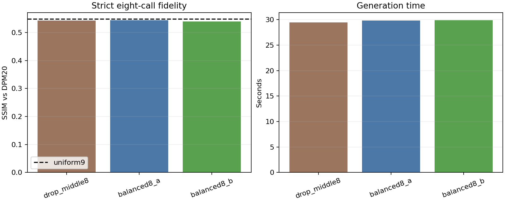

# Balanced eight-call development comparison

Ten analysis prompts with two seeds were evaluated. Existing DPM20, uniform9, and drop-middle8 results were reused; consumed held-out prompts were not touched.

## Aggregate results

| Mode | Max gap | Full calls | Seconds | SSIM | PSNR (dB) | RGB error |
| --- | ---: | ---: | ---: | ---: | ---: | ---: |
| uniform9 | 3 | 9 | 31.73 | 0.5481 | 15.391 | 0.1209 |
| drop_middle8 | 5 | 8 | 29.45 | 0.5432 | 15.330 | 0.1220 |
| balanced8_a | 3 | 8 | 29.84 | 0.5439 | 15.367 | 0.1213 |
| balanced8_b | 3 | 8 | 29.90 | 0.5398 | 15.274 | 0.1233 |

## Paired improvement over drop-middle8

Positive differences favor the balanced schedule. Intervals resample whole prompt groups.

| Candidate | SSIM difference | 95% CI | Prompts better/worse |
| --- | ---: | ---: | ---: |
| balanced8_a | 0.00062 | [-0.00374, 0.00424] | 7/3 |
| balanced8_b | -0.00348 | [-0.00890, 0.00196] | 5/5 |

Best observed strict eight-call schedule: **balanced8_a**.

## Boundary

This is development-set schedule selection. A future final claim needs a newly reserved validation set; the previously consumed held-out prompts must not be reused.
