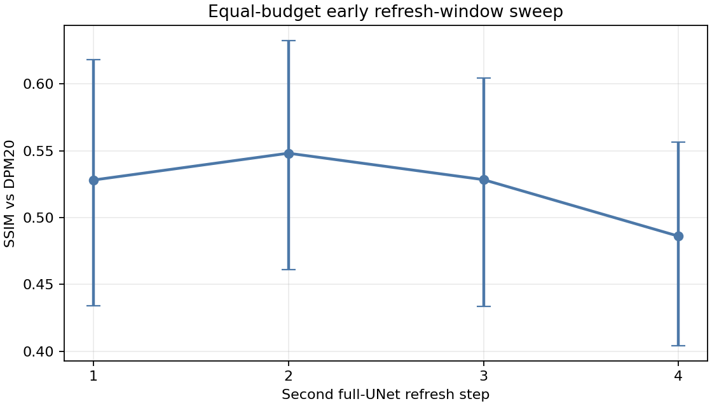

# Early refresh-window sweep

Closed-loop development experiment on 10 prompts and two seeds. Every schedule uses nine full UNet calls; only the second refresh moves among steps 1, 2, 3, and 4. Held-out prompts were not used.

## Aggregate results

| Second refresh | Seconds | SSIM | PSNR (dB) | RGB error |
| ---: | ---: | ---: | ---: | ---: |
| 1 | 31.31 | 0.5281 | 15.087 | 0.1252 |
| 2 | 31.73 | 0.5481 | 15.391 | 0.1209 |
| 3 | 31.41 | 0.5283 | 14.895 | 0.1284 |
| 4 | 31.35 | 0.4861 | 14.104 | 0.1434 |

## Difference from step 2

Positive values mean the candidate is closer to uncached DPM20. Intervals resample whole prompt groups.

| Candidate step | SSIM difference | 95% CI | Prompts better/worse |
| ---: | ---: | ---: | ---: |
| 1 | -0.02005 | [-0.04971, 0.00815] | 4/6 |
| 3 | -0.01976 | [-0.04717, 0.00711] | 4/6 |
| 4 | -0.06199 | [-0.10571, -0.02596] | 1/9 |

## Limits

- This is development-set policy analysis, not held-out validation.
- SSIM and PSNR measure similarity to uncached DPM20, not absolute quality.
- Step 2 reuses the prior uniform9 run; the other positions were newly measured.
- Each case has one timed run per newly measured mode.
