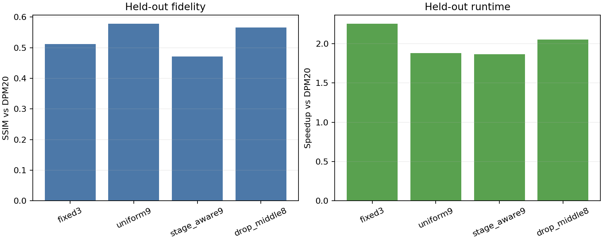

# One-time held-out final validation

Five previously unused prompts with two seeds were evaluated once under the frozen protocol. Positive paired differences favor the method in the left column.

## Aggregate results

| Mode | Full calls | Seconds | Speedup | SSIM | PSNR (dB) | RGB error |
| --- | ---: | ---: | ---: | ---: | ---: | ---: |
| dpm20 | 20 | 59.74 | 1.00× | 1.0000 | — | 0.0000 |
| fixed3 | 7 | 26.55 | 2.25× | 0.5115 | 15.446 | 0.1235 |
| uniform9 | 9 | 31.80 | 1.88× | 0.5777 | 16.113 | 0.1071 |
| stage_aware9 | 9 | 32.06 | 1.86× | 0.4719 | 14.695 | 0.1377 |
| drop_middle8 | 8 | 29.11 | 2.05× | 0.5656 | 15.983 | 0.1101 |

## Frozen primary decision

- Paired SSIM difference, drop_middle8 − uniform9: **-0.01203** (prompt-bootstrap 95% CI [-0.02126, -0.00339]).
- Prompt groups better/worse: 1/4.
- Prompt groups losing more than 0.03: none.
- Frozen decision: **REJECT drop_middle8**.

| Frozen check | Pass |
| --- | ---: |
| mean_ssim_loss_at_most_0.01 | no |
| at_most_one_prompt_loses_over_0.03 | yes |
| exactly_eight_full_calls | yes |
| faster_than_uniform9 | yes |

## Interpretation boundary

These held-out prompts are now consumed. This result may select between the frozen candidates, but it must not be used to tune another schedule and then claim validation on the same prompts.
