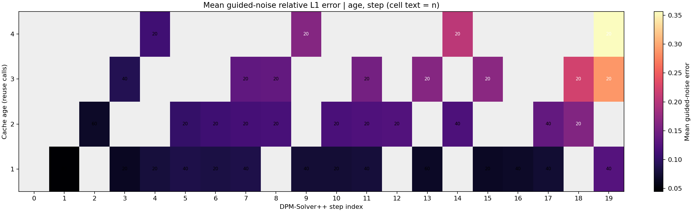

# Fixed-interval Oracle sweep

Intervals 2, 3, 4, 5; interval 3 reuses the completed 2026-09-11 run.
80 paired images, 1600 UNet steps, 1080 reuse observations. The same reference image and latent hash matched across all intervals.

## Leave-one-prompt-out prediction

Linear least-squares models with an intercept were trained on nine prompts and evaluated on the excluded prompt, repeating for all ten prompts. Both seeds and all intervals of each held-out prompt stay together. RMSE and MAE pool out-of-prompt predictions; refresh steps are excluded.

| Target | Model | RMSE | MAE |
| --- | --- | ---: | ---: |
| guided_noise_error | intercept | 0.07395 | 0.05467 |
| guided_noise_error | age | 0.06100 | 0.04706 |
| guided_noise_error | lambda_distance | 0.06188 | 0.04637 |
| guided_noise_error | age+lambda_distance | 0.06121 | 0.04695 |
| boundary_error | intercept | 0.13328 | 0.10892 |
| boundary_error | age | 0.07746 | 0.05633 |
| boundary_error | lambda_distance | 0.09229 | 0.06958 |
| boundary_error | age+lambda_distance | 0.07860 | 0.05749 |

## Paired model differences

Negative delta RMSE favors the richer model. Percentile intervals resample the ten held-out prompt groups 5,000 times.

| Target | Simple | Richer | Delta RMSE | 95% prompt-bootstrap interval |
| --- | --- | --- | ---: | ---: |
| guided_noise_error | age | lambda_distance | 0.00088 | [-0.00296, 0.00379] |
| guided_noise_error | age | age+lambda_distance | 0.00021 | [-0.00134, 0.00150] |
| guided_noise_error | lambda_distance | age+lambda_distance | -0.00067 | [-0.00242, 0.00187] |
| boundary_error | age | lambda_distance | 0.01484 | [0.00713, 0.02047] |
| boundary_error | age | age+lambda_distance | 0.00114 | [0.00060, 0.00174] |
| boundary_error | lambda_distance | age+lambda_distance | -0.01370 | [-0.01976, -0.00559] |

## Age and step

Cell labels show observation counts. Gray cells have no reuse observations; refresh-step zeros are excluded. The errors are local to the uncached teacher trajectory, not final generated-image quality.

## Stage and age averages

Stages follow the earlier Oracle analysis: early steps 0-6, middle 7-13, late 14-19. Values are relative L1 means on reuse rows.

| Stage | Age | n | Guided-noise error | Boundary error |
| --- | ---: | ---: | ---: | ---: |
| early | 1 | 180 | 0.06406 | 0.18095 |
| early | 2 | 100 | 0.08333 | 0.29777 |
| early | 3 | 40 | 0.09086 | 0.36475 |
| early | 4 | 20 | 0.11093 | 0.48436 |
| middle | 1 | 200 | 0.07569 | 0.16977 |
| middle | 2 | 100 | 0.11947 | 0.31461 |
| middle | 3 | 80 | 0.14730 | 0.42649 |
| middle | 4 | 20 | 0.16327 | 0.53231 |
| late | 1 | 140 | 0.08656 | 0.14788 |
| late | 2 | 100 | 0.13563 | 0.25974 |
| late | 3 | 60 | 0.22655 | 0.38772 |
| late | 4 | 40 | 0.28066 | 0.48852 |

## Interpretation limits

- All intervals share the same ten development prompts; five held-out prompts were not used.
- Age and lambda distance are correlated; linear predictive value does not identify a causal driver.
- This sweep does not test a V2 policy or compare final image quality at equal compute budgets.
