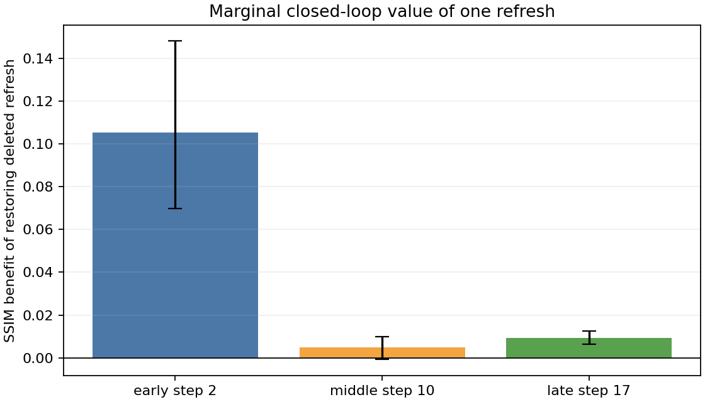

# Refresh-position ablation

Closed-loop development experiment on 10 prompts and two seeds. Each eight-call mode removes exactly one refresh from uniform9. Held-out prompts were not used.

## Aggregate results

| Mode | Deleted step | Full calls | Seconds | SSIM | PSNR (dB) | RGB error |
| --- | ---: | ---: | ---: | ---: | ---: | ---: |
| uniform9 | none | 9 | 31.73 | 0.5481 | 15.391 | 0.1209 |
| drop_early8 | 2 | 8 | 29.47 | 0.4427 | 13.476 | 0.1563 |
| drop_middle8 | 10 | 8 | 29.45 | 0.5432 | 15.330 | 0.1220 |
| drop_late8 | 17 | 8 | 29.36 | 0.5387 | 15.335 | 0.1218 |

## Marginal refresh benefit

Positive values mean restoring the deleted refresh improves fidelity. Intervals resample whole prompt groups.

| Deleted refresh | SSIM benefit | 95% CI | PSNR benefit | RGB-error reduction | Prompts SSIM +/− |
| --- | ---: | ---: | ---: | ---: | ---: |
| step 2 | 0.10542 | [0.06989, 0.14802] | 1.9144 | 0.03541 | 10/0 |
| step 10 | 0.00487 | [-0.00077, 0.00995] | 0.0605 | 0.00108 | 7/3 |
| step 17 | 0.00941 | [0.00626, 0.01249] | 0.0558 | 0.00085 | 10/0 |

## Limits

- This is development-set policy analysis, not held-out validation.
- Marginal effects are conditional on the other uniform9 refresh positions.
- SSIM and PSNR measure similarity to uncached DPM20, not absolute quality.
- Each case has one timed run per dropout mode.
