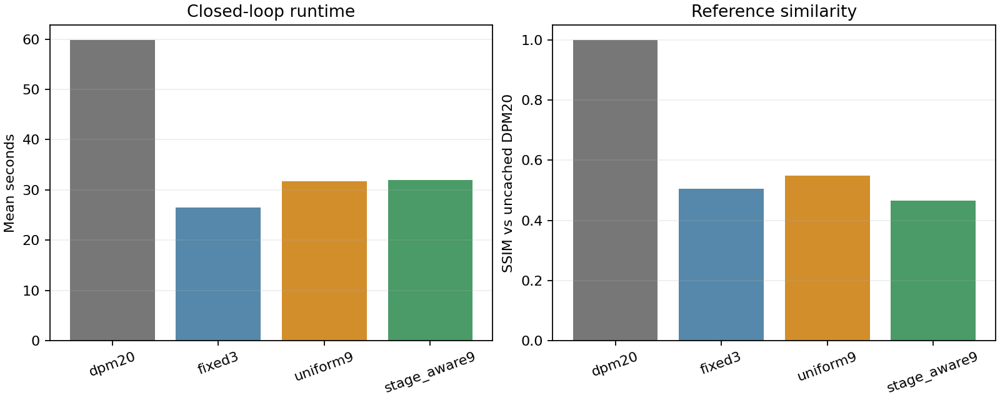

# Stage-aware V2 development experiment

Closed-loop SD1.5/DPM-Solver++ generation on 10 development prompts and two seeds. Held-out prompts were not used.

## Aggregate results

| Mode | Full calls | Mean seconds | Speedup | SSIM | PSNR (dB) | Mean RGB error |
| --- | ---: | ---: | ---: | ---: | ---: | ---: |
| dpm20 | 20 | 59.82 | 1.00x | 1.0000 | infinite | 0.0000 |
| fixed3 | 7 | 26.48 | 2.26x | 0.5057 | 14.686 | 0.1327 |
| uniform9 | 9 | 31.73 | 1.89x | 0.5481 | 15.391 | 0.1209 |
| stage_aware9 | 9 | 32.02 | 1.87x | 0.4665 | 13.832 | 0.1471 |

## Equal-budget comparison

Stage-aware9 minus uniform9; both use exactly nine full UNet calls. Intervals resample whole prompt groups, keeping the two seeds together.

| Metric | Mean difference | 95% prompt-bootstrap interval | Prompts better/worse |
| --- | ---: | ---: | ---: |
| ssim | -0.081642 | [-0.115540, -0.053777] | 0/10 |
| psnr_db | -1.558533 | [-2.431642, -0.827021] | 0/10 |
| mean_absolute_rgb_error | 0.026122 | [0.014981, 0.038615] | 0/10 |
| seconds | 0.297013 | [0.164962, 0.426712] | 1/9 |

## Limits

- This is policy selection on development prompts, not held-out validation.
- SSIM and PSNR measure similarity to uncached DPM20, not absolute image quality.
- Each case has one timed run per mode; timing differences need repeated measurements.
- The experiment tests one stage-aware allocation at one nine-call budget.
